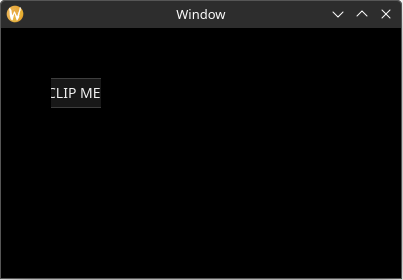

# Scissoring Rectangles

Yarrow does not have a concept of "parent"/"container" elements like most GUI libraries do. This means you cannot just put elements inside of a `ScrollArea` element.

Instead, to create a scroll area, Yarrow first has you assign elements to "scissoring rectangles". Elements that are not manually assigned a scissoring rectangle will use the "default scissoring rectangle" which is just the entire window.

## Defining Scissoring Rectangles

Each scissoring rectangle is manually assigned an integer "ID". This ID can be any `u32` value (expect for `u32::MAX` which is reserved for the "default scissoring rectangle" that covers the whole window).

Define the scissoring rectangles you wish to use as a set of constants (or alternatively as an enum). For example:

```rust
pub const SIDE_PANEL_SRECT: ScissorRectID = ScissorRectID(0);
pub const TAB_A_CONTENT_SRECT: ScissorRectID = ScissorRectID(1);
pub const TAB_B_CONTENT_SRECT: ScissorRectID = ScissorRectID(2);
```

> Yarrow does not have a concept of "nested" scissoring rectangles. This would have made the library implementation a lot more complex so I decided against it.

## Assigning Scissoring Rectangles to Elements

Scissoring rectangles can only be assigned to elements in their builders. Once an element is assigned a scissoring rectangle, it cannot be assigned to a different one.

Here is a quick example of a text input being assigned to a scissoring rectangle and being clipped:

```rust
# use yarrow::prelude::*;
# 
# pub fn main() {
#     let (action_sender, action_receiver) = yarrow::action_channel();
#     yarrow::run_blocking(MyApp::default(), action_sender, action_receiver).unwrap();
# }
# 
# #[derive(Default)]
# struct MyApp {
#     main_window_elements: Option<MainWindowElements>,
# }
# 
# impl Application for MyApp {
#     type Action = ();
# 
#     fn on_window_event(
#         &mut self,
#         event: AppWindowEvent,
#         window_id: WindowID,
#         cx: &mut AppContext<()>,
#     ) {
#         match event {
#             AppWindowEvent::WindowOpened => {
#                 if window_id == MAIN_WINDOW {
#                     yarrow::theme::yarrow_dark::load(Default::default(), &mut cx.res);
#                     let mut cx = cx.window_context(MAIN_WINDOW).unwrap();
#                     self.main_window_elements = Some(MainWindowElements::build(&mut cx));
#                 }
#             }
#             _ => {}
#         }
#     }
# }
# 
pub const MY_SRECT: ScissorRectID = ScissorRectID(0);

pub struct MainWindowElements {
    text_input: TextInput,
}

impl MainWindowElements {
    pub fn build(cx: &mut WindowContext<'_, ()>) -> Self {
        // The position and size of the scissoring rectangle can be set at any time.
        cx.view.update_scissor_rect(
            MY_SRECT,
            Some(rect(50.0, 50.0, 50.0, 30.0)),
            None, // new_scroll_offset
        );

        Self {
            text_input: TextInput::builder()
                .text("CLIP ME!!!")
                .rect(rect(0.0, 0.0, 100.0, 30.0)) // 1
                // Assign this element to the scissoring rectangle.
                .scissor_rect(MY_SRECT)
                .build(cx)
        }
    }
}
```

1. NOTE: The position of an element is relative to the origin of its assigned scissoring rectangle, so this element will appear to be at the position `(50.0, 50.0)`.


# Scroll Offset

Scissoring rectangles also have a "scroll offset" vector which can be used to "scroll" the contents.

If we set the scroll offset vector from the example above, notice how the element appeared to have been scrolled 10 points to the left and now has its left side clipped:

```rust
# use yarrow::prelude::*;
# 
# pub fn main() {
#     let (action_sender, action_receiver) = yarrow::action_channel();
#     yarrow::run_blocking(MyApp::default(), action_sender, action_receiver).unwrap();
# }
# 
# #[derive(Default)]
# struct MyApp {
#     main_window_elements: Option<MainWindowElements>,
# }
# 
# impl Application for MyApp {
#     type Action = ();
# 
#     fn on_window_event(
#         &mut self,
#         event: AppWindowEvent,
#         window_id: WindowID,
#         cx: &mut AppContext<()>,
#     ) {
#         match event {
#             AppWindowEvent::WindowOpened => {
#                 if window_id == MAIN_WINDOW {
#                     yarrow::theme::yarrow_dark::load(Default::default(), &mut cx.res);
#                     let mut cx = cx.window_context(MAIN_WINDOW).unwrap();
#                     self.main_window_elements = Some(MainWindowElements::build(&mut cx));
#                 }
#             }
#             _ => {}
#         }
#     }
# }
# 
# pub const MY_SRECT: ScissorRectID = ScissorRectID(0);
# 
# pub struct MainWindowElements {
#     text_input: TextInput,
# }
# 
# impl MainWindowElements {
#     pub fn build(cx: &mut WindowContext<'_, ()>) -> Self {
        cx.view.update_scissor_rect(
            MY_SRECT,
            Some(rect(50.0, 50.0, 50.0, 30.0)),
            // Scroll horizontally by 10.0 points.
            Some(Vector::new(10.0, 0.0)), // changed
        );
# 
#         Self {
#             text_input: TextInput::builder()
#                 .text("CLIP ME!!!")
#                 // NOTE: The position of an element is relative to the origin of its
#                 // assigned scissoring rectangle, so this element will appear to be
#                 // at the position `(50.0, 50.0)`.
#                 .rect(rect(0.0, 0.0, 100.0, 30.0))
#                 // Assign this element to the scissoring rectangle.
#                 .scissor_rect(MY_SRECT)
#                 .build(cx)
#         }
#     }
# }
```



# Scroll Areas

You probably want to add a scrollbar and have the scroll offset change via the mouse's scroll wheel. To do this, you use the `ScrollArea` element in Yarrow.

As an added bonus, you can set a `ScrollArea` element to "control" a scissoring rectangle, meaning that it will automatically update the scissoring rectangle's position, size, and scroll offset to match that of the `ScrollArea` element.

Here's an example of a `ScrollArea` element:

```rust
# use yarrow::prelude::*;
# 
# pub fn main() {
#     let (action_sender, action_receiver) = yarrow::action_channel();
#     yarrow::run_blocking(MyApp::default(), action_sender, action_receiver).unwrap();
# }
# 
# pub const CONTENT_SRECT: ScissorRectID = ScissorRectID(0);
# 
# #[derive(Default)]
# struct MyApp {
#     main_window_elements: Option<MainWindowElements>,
# }
# 
# impl Application for MyApp {
#     type Action = ();
# 
#     fn on_window_event(
#         &mut self,
#         event: AppWindowEvent,
#         window_id: WindowID,
#         cx: &mut AppContext<()>,
#     ) {
#         match event {
#             AppWindowEvent::WindowOpened => {
#                 if window_id == MAIN_WINDOW {
#                     yarrow::theme::yarrow_dark::load(Default::default(), &mut cx.res);
# 
#                     let mut cx = cx.window_context(MAIN_WINDOW).unwrap();
# 
#                     self.main_window_elements =
#                         Some(MainWindowElements::build(&mut cx));
#                     self.main_window_elements.as_mut().unwrap().layout(&mut cx);
#                 }
#             }
#             AppWindowEvent::WindowResized => {
#                 if window_id == MAIN_WINDOW {
#                     let mut cx = cx.window_context(MAIN_WINDOW).unwrap();
# 
#                     self.main_window_elements.as_mut().unwrap().layout(&mut cx);
#                 }
#             }
#             _ => {}
#         }
#     }
# }
# 
pub struct MainWindowElements {
    long_boi: TextInput,
    scroll_area: ScrollArea,
}

impl MainWindowElements {
    pub fn build(cx: &mut WindowContext<'_, ()>) -> Self {
        Self {
            long_boi: TextInput::builder()
                .text("L0ng b0I")
                .scissor_rect(CONTENT_SRECT)
                .build(cx),
            scroll_area: ScrollArea::builder()
                // Set the z index higher than the contents so that it has
                // priority on mouse events.
                .z_index(1)
                // Set the scissoring rectangle that this element should control.
                .control_scissor_rect(CONTENT_SRECT)
                // Note, do *NOT* assign the scroll area element itself to the
                // scissoring rectangle it controls, or it will not function
                // properly.
                .scissor_rect(ScissorRectID::DEFAULT)
                .build(cx),
        }
    }

    pub fn layout(&mut self, cx: &mut WindowContext<'_, ()>) {
        // Assign the scroll area element to fill the area we want (in this
        // case the entire window).
        self.scroll_area
            .el
            .set_rect(Rect::from_size(cx.logical_size()));

        // Layout the elements like normal.
        //
        // NOTE: The position of an element is relative to the origin of its
        // assigned scissoring rectangle. So if the position of the rectangle
        // of `self.scroll_area` was `(50.0, 70.0)`, then the position of this
        // element will be offset by that amount.
        self.long_boi.el.set_rect(rect(20.0, 20.0, 200.0, 1000.0));

        // Set the "content size" of the scroll area. In this case we want it
        // to cover the size of our elements with a bit of padding.
        self.scroll_area.set_content_size(Size::new(
            self.long_boi.el.rect().max_x() + 20.0,
            self.long_boi.el.rect().max_y() + 20.0,
        ));
    }
}
```

## Builder Shorthands

Setting the scissoring rectangle on every single element builder can be cumbersome. Luckily, a `WindowContext` has a concept of a "scissoring rectangle stack" where elements that don't have a defined scissoring rectangle will fall back to the most recently pushed scissoring rectangle on that stack. For example:

```rust,ignore
pub fn my_builder(cx: &mut WindowContext<'_, MyAction>) -> Self {
    // This element will be assigned to the "default scissoring rectangle"
    // that covers the whole window.
    let label1 = Label::builder().build(cx);

    cx.push_scissor_rect(ScissorRectID(5));

    // These elements will be assigned to the scissoring rectangle with
    // ID "5".
    let label2 = Label::builder().build(cx);
    let label3 = Label::builder().build(cx);

    // This elements will be assigned to the scissoring rectangle with
    // ID "20".
    let label4 = Label::builder()
        .scissor_rect(ScissorRectID(20))
        .build(cx);

    // This elements will be assigned to the scissoring rectangle with
    // ID "5".
    let label5 = Label::builder().build(cx);

    cx.push_scissor_rect(ScissorRectID(10));

    // This elements will be assigned to the scissoring rectangle with
    // ID "10".
    let label6 = Label::builder().build(cx);

    cx.pop_scissor_rect();

    // This elements will be assigned to the scissoring rectangle with
    // ID "5".
    let label7 = Label::builder().build(cx);

    cx.pop_scissor_rect();

    // This element will be assigned to the "default scissoring rectangle"
    // that covers the whole window.
    let label8 = Label::builder().build(cx);
}
```

Yarrow also includes a `with_scissor_rect` method that automatically calls `cx.push_scissor_rect()` and `cx.pop_scissor_rect()` for you:

```rust,ignore
pub fn my_builder(cx: &mut WindowContext<'_, MyAction>) -> Self {
    // This element will be assigned to the "default scissoring rectangle"
    // that covers the whole window.
    let label1 = Label::builder().build(cx);

    let (label2, label3) = cx.with_scissor_rect(ScissorRectID(5), |cx| {
        // These elements will be assigned to the scissoring rectangle with
        // ID "5".
        let label2 = Label::builder().build(cx);
        let label3 = Label::builder().build(cx);

        (label2, label3)
    });

    // This element will be assigned to the "default scissoring rectangle"
    // that covers the whole window.
    let label4 = Label::builder().build(cx);
}
```

There is also a `with_z_index_and_scissor_rect` method that lets you set both a z index and a scissoring rectangle ID at once.
