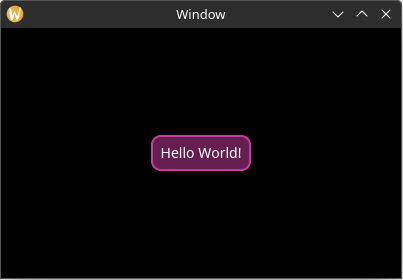

# Adding Style

Now let's make the label more visually interesting.

To be more representative of a real-world application, let us define a struct to hold all of the style related information about our application:

```rust
#[derive(Default)]
struct MyStyle {}
```

This struct has no fields yet, but we will add some later.

For now, let us define a method which loads the styles for the elements we want:

```rust
impl MyStyle {
    pub fn load(&self, res: &mut ResourceCtx) { // 1
        res.style_system.add( // 2
            "",   // 3
            true, // 4
            LabelStyle { // 5
                back_quad: QuadStyle {
                    bg: background_hex(0x641e50),
                    border: border(hex(0xc83ca0), 2.0, radius(10.0)),
                },
                text_padding: padding_all_same(10.0),
                ..Default::default() // 6
            },
        );
    }
}
```

1. Pass in the `ResourceCtx`, which is a context for the globally shared resources in a Yarrow application.
2. Add a style to the context's `StyleSystem`.
3. The "class name". Only elements that have this class name will have this style applied to them. The blank name of `""` means to set it as the default style for all elements of this type which don't have a defined class name.
4. Whether or not this style is a dark theme variant (true) or a light theme variant (false). This allows for easy switching between light and dark variants later.
5. Every element type defines its own custom style struct with custom properties.
6. The `..Default::default()` syntax is handy for not defining properties you do not use.

Now store our new style struct in `MyApp` and load it when the application starts:

```rust
#[derive(Default)]
struct MyApp {
    // ...

    // new
    style: MyStyle,
}

impl Application for MyApp {
    type Action = ();

    fn on_window_event(
        &mut self,
        event: AppWindowEvent,
        window_id: WindowID,
        cx: &mut AppContext<Self::Action>,
    ) {
        match event {
            AppWindowEvent::WindowOpened => {
                if window_id == MAIN_WINDOW {
                    // new
                    self.style.load(&mut cx.res);

                    let mut main_window_cx =
                        cx.window_context(MAIN_WINDOW).unwrap();

                    // ...
                }
            }
            // ...
        }
    }
}
```

Now our label is looking fancy!



# Loading a Theme

By default all elements have a style which is very bare-bones (and most of the time colors are set to transparent). If you want a quicker starting place, you can load one of Yarrow's built in themes. A "theme" is simply a function with a few tweakable parameters that adds a bunch of styles.

At the time of this writing, Yarrow has only one built-in theme called "Yarrow dark". To use it, simply add this inside of `MyStyle::load()`:

```rust
yarrow::theme::yarrow_dark::load(Default::default(), res);
```

After loading a theme, it's probably a good idea to use a class for our custom fancy label so it doesn't conflict with the default one in the theme:

```rust
// In MyStyle::load

res.style_system.add(
    "fancy_label", // changed
    // ...
);

// In MainWindowElements::build

hello_label: Label::builder()
    .text("Hello World!")
    .class("fancy_label") // new
    .build(cx),

```