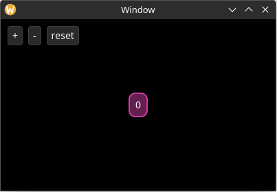

# Responding to Actions

Now it's time to make our application do things. Let's start by making a simple counter that gets incremented when the user selects the "increase" button, gets decremented when the user selects the "decrease" button, and resets when the user selects the "reset" button.

In Yarrow, any single event that a user can perform in your application is called an "Action". *(While I could have called it an "Event", I chose this name to differentiate it from events that elements receive from Yarrow.)*

## Defining the Action Type

We get to define what actions we want. Rust's `enum` type works especially well here 🦀:

```rust
#[derive(Clone)] // 1
pub enum MyAction {
    OffsetCounterBy(i32), // 2
    ResetCounter,
}
```

1. Actions must implement [`Clone`](https://doc.rust-lang.org/std/clone/trait.Clone.html).
2. While we could have just defined two enum variants called `IncrementValue` and `DecrementValue`, I want to show an example of an action that has associated data.

Now that we have defined a type for our actions, update the code with the following changes:

```rust
impl MainWindowElements {
    fn build(cx: &mut WindowContext<'_, MyAction>) -> Self {
// ...
    fn layout(&mut self, cx: &mut WindowContext<'_, MyAction>) {
// ...

impl Application for MyApp {
    type Action = MyAction;
// ...
```

## Storing and Syncing State

We also need to store the state of our counter somewhere. Also, let's add a method to `MyApp` that syncs the label text to the state:

```rust
#[derive(Default)]
struct MyApp {
    count: i32, // new
// ...

// new
impl MyApp {
    pub fn sync_state(&mut self, cx: &mut WindowContext<'_, MyAction>) {
        let Some(elements) = &mut self.main_window_elements else { // 1
            return;
        };

        // 2
        if elements
            .hello_label
            .set_text(Some(&format!("{}", self.count)), cx.res) // 3
        {
            // Changing the text may resize the label, so do a layout.
            elements.layout(&self.style, cx);
        }
    }
}

impl Application for MyApp {
    // ...

    fn on_window_event(
        &mut self,
        event: AppWindowEvent,
        window_id: WindowID,
        cx: &mut AppContext<Self::Action>,
    ) {
        match event {
            AppWindowEvent::WindowOpened => {
                if window_id == MAIN_WINDOW {
                    self.style.load(&mut cx.res);

                    let mut main_window_cx = cx.window_context(MAIN_WINDOW).unwrap();

                    self.main_window_elements =
                        Some(MainWindowElements::build(&mut main_window_cx));

                    // new
                    self.sync_state(&mut main_window_cx);
                }
            }
// ...
```

1. The [`let-else pattern`](https://doc.rust-lang.org/beta/rust-by-example/flow_control/let_else.html) in Rust is useful to extract the elements without placing ugly `unwrap`'s everywhere.
2. Each setter on an element handle returns a bool on whether or not the value has changed. (TODO: Actually implement this lol)
3. Note that setting a value on an element handle won't trigger an update in Yarrow's system unless that value has changed. Therefore you can still get good performance even when you have a single `sync_state` function like this. However, if the performance still isn't good enough, you can change it to be as optimized and fine-grained as you wish. You are in control!

## Add Buttons

Now we will create the three new buttons:

```rust
struct MainWindowElements {
    // new
    increment_btn: Button,
    decrement_btn: Button,
    reset_btn: Button,

// ...

impl MainWindowElements {
    fn build(count: i32, cx: &mut WindowContext<'_, MyAction>) -> Self {
        Self {
            // new
            increment_btn: Button::builder()
                .text("+")
                .build(cx),
            decrement_btn: Button::builder()
                .text("-")
                .build(cx),
            reset_btn: Button::builder()
                .text("reset")
                .build(cx),
// ...
```

Now to lay out the buttons so they are visible. While we're at it, let's add additional styling information in our `MyStyle` struct so we can easily tweak all style parameters from a single location:

```rust
struct MyStyle {
    // new
    window_padding: Padding,
    button_spacing: f32,
}

// new
impl Default for MyStyle {
    fn default() -> Self {
        Self {
            window_padding: padding_all_same(10.0),
            button_spacing: 8.0,
        }
    }
}

impl MainWindowElements {
    // ...

    // changed
    fn layout(&mut self, style: &MyStyle, cx: &mut WindowContext<'_, MyAction>) {
        // ...

        // new
        self.increment_btn.layout(
            point(style.window_padding.left, style.window_padding.top),
            cx.res,
        );
        self.decrement_btn.layout(
            point(
                self.increment_btn.el.rect().max_x() + style.button_spacing,
                style.window_padding.top,
            ),
            cx.res,
        );
        self.reset_btn.layout(
            point(
                self.decrement_btn.el.rect().max_x() + style.button_spacing,
                style.window_padding.top,
            ),
            cx.res,
        );
    }
// ...

impl Application for MyApp {
    type Action = MyAction;

    fn on_window_event(
        &mut self,
        event: AppWindowEvent,
        window_id: WindowID,
        cx: &mut AppContext<Self::Action>,
    ) {
        match event {
            AppWindowEvent::WindowOpened => {
                if window_id == MAIN_WINDOW {
                    // ...

                    self.main_window_elements
                        .as_mut()
                        .unwrap()
                        .layout(&self.style, &mut main_window_cx) // changed
                }
            }
            AppWindowEvent::WindowResized => {
                if window_id == MAIN_WINDOW {
                    // ...

                    self.main_window_elements
                        .as_mut()
                        .unwrap()
                        .layout(&self.style, &mut main_window_cx) // changed
// ...

```

The app should now display the following:



## Handle the Actions

Finally, let's add the appropriate actions to the buttons and handle them:

```rust
impl MainWindowElements {
    fn build(cx: &mut WindowContext<'_, MyAction>, count: i32) -> Self {
        Self {
            increment_btn: Button::builder()
                .text("+")
                .on_select(MyAction::OffsetCounterBy(1)) // new
                .build(cx),
            decrement_btn: Button::builder()
                .text("-")
                .on_select(MyAction::OffsetCounterBy(-1)) // new
                .build(cx),
            reset_btn: Button::builder()
                .text("reset")
                .on_select(MyAction::ResetCounter) // new
                .build(cx),
// ...

impl Application for MyApp {
    type Action = MyAction;

    // new
    fn on_action_emitted(&mut self, cx: &mut AppContext<Self::Action>) {
        let Some(mut main_window_cx) = cx.window_context(MAIN_WINDOW) else { // 1
            return;
        };

        while let Ok(action) = cx.action_receiver.try_recv() {
            match action {
                MyAction::OffsetCounterBy(offset) => {
                    self.count += offset;
                    self.sync_state(&mut main_window_cx);
                }
                MyAction::ResetCounter => {
                    self.count = 0;
                    self.sync_state(&mut main_window_cx);
                }
            }
        }
    }
// ...
```

1. The [`let-else pattern`](https://doc.rust-lang.org/beta/rust-by-example/flow_control/let_else.html) can be useful here again so the window context doesn't have to be extracted from the application context inside every match variant. Although note this won't work if you have multiple windows in your application.

Now run the application and count things!

## Improving `sync_state`

One last thing, while our `sync_count` function is fine for this simple application, in a larger application you will probably want to only perform a single state sync and layout once for every invocation of `on_action_emitted`.

One strategy is to pass around a bool like this:

```rust
impl MyApp {
    pub fn sync_state(&mut self, cx: &mut WindowContext<'_, MyAction>) {
        let Some(elements) = &mut self.main_window_elements else {
            return;
        };

        let mut needs_layout = false;

        if elements
            .hello_label
            .set_text(Some(&format!("{}", self.count)), cx.res)
        {
            // Changing the text may resize the label, so do a layout.
            needs_layout = true;
        }

        if needs_layout {
            elements.layout(&self.style, cx);
        }
    }
}

impl Application for MyApp {
    type Action = MyAction;

    fn on_action_emitted(&mut self, cx: &mut AppContext<Self::Action>) {
        let Some(mut main_window_cx) = cx.window_context(MAIN_WINDOW) else {
            return;
        };

        let mut state_changed = false;

        while let Ok(action) = main_window_cx.action_receiver.try_recv() {
            match action {
                MyAction::OffsetCounterBy(offset) => {
                    self.count += offset;
                    state_changed = true;
                }
                MyAction::ResetCounter => {
                    self.count = 0;
                    state_changed = true;
                }
            }
        }

        if state_changed {
            self.sync_state(&mut main_window_cx);
        }
    }
// ...
```

And again, it's up to you how fine-grained and optimized you want your state synchronization and layout to be. You are in control!