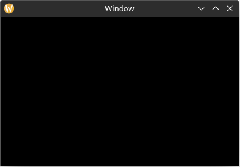

# Setting Up

First, create a new Rust project with the following command:

`cargo new --bin hello_yarrow`

## Adding Yarrow as a dependency

In the newly created directory, open the `Cargo.toml` file and add the following under `[dependencies]`:

```toml
[package]
name = "hello_yarrow"
version = "0.1.0"
edition = "2021"

[dependencies]
yarrow = { git = "https://github.com/MeadowlarkDAW/Yarrow.git", branch = "main" }
```

> Yarrow does not have a recent version published on crates.io yet, so you will need to use the git version for now.

## Enabling Additional Optimizations

Some aspects of Yarrow such as text shaping can run very slow when compiled in debug mode without any optimizations. It is recommended to add the follow to your `Cargo.toml` file to get acceptable performance when running in debug mode:

```toml
[profile.dev]
opt-level = 1
```

## Initializing the Application

In `main.rs`, replace the default contents with the following:

```rust
use yarrow::prelude::*; // 1

pub fn main() {
    let (action_sender, action_receiver) = yarrow::action_channel(); // 2

    yarrow::run_blocking( // 3
        MyApp::new(action_sender.clone(), action_receiver),
        action_sender,
    )
    .unwrap();
}

struct MyApp { // 4
    _action_sender: ActionSender<()>,
    _action_receiver: ActionReceiver<()>,
}

impl MyApp {
    fn new(
        action_sender: ActionSender<()>,
        action_receiver: ActionReceiver<()>
    ) -> Self {
        Self {
            _action_sender: action_sender,
            _action_receiver: action_receiver,
        }
    }
}

impl Application for MyApp { // 5
    type Action = (); // 6
}
```

Here is a breakdown of what is happening:

1. Import a bunch of types from Yarrow. Yarrow provides a `prelude` module that re-exports most of everything you need for simplicity.
2. Create an action channel. We will cover what actions are and how they work later in this chapter. For now just know this is essentially an [mpsc](https://doc.rust-lang.org/std/sync/mpsc/) channel from Rust's standard library.
3. Run our application. For standalone applications you will want to use `run_blocking`, but Yarrow contains other methods for running in different kinds of contexts (like an audio plugin).
4. Our application struct. This is where we will store everything related to our application. Note that we are holding onto the action channel objects, as we will use them later. (Your application struct must hold on to at least the `ActionReceiver` object or it might panic).
5. The `yarrow::Application` trait. We must implement this for our application object.
6. Define the type to use as our applications's action message. For now we have no actions, so we will set it to the empty type `()`.

## Running the Application

Now run the application using the command `cargo run`. Once it finishes compiling you should see an empty black window.



> The first compile may take quite a while as it is compiling an entire GUI library from scratch. Subsequent compiles should be much faster.

Yarrow is still experimental software. If you run into any issues while compiling or running this code, please create an issue in the [github repository](https://github.com/MeadowlarkDAW/Yarrow/issues).