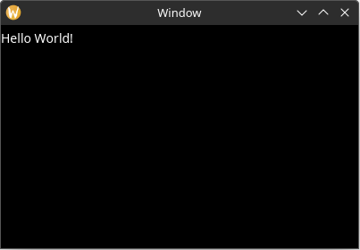
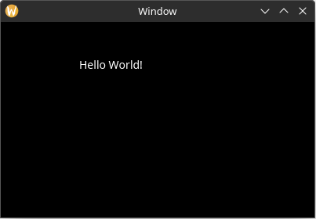
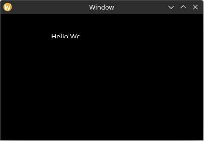

# Static Layout

If you run the application now, you will see that the window is still blank. This is because in order for elements to become active and be rendered, they must have a defined "bounding rectangle".

You can add a bounding rectangle by using the `rect` property on the label builder like this. Now the label is visible when the app is run.

```rust
hello_label: Label::builder()
    .text("Hello World!")
    .rect(rect(0.0, 0.0, 100.0, 30.0)) // new
    .build(cx),
```



If we want to place the label in a different position, all we need to do is change the (x, y) values in the bounding rect:

```rust
.rect(rect(100.0, 40.0, 100.0, 30.0))
```



Also note that if we make the (width, height) values in the bounding rect small enough, the text will be clipped:

```rust
.rect(rect(100.0, 40.0, 55.0, 10.0))
```

