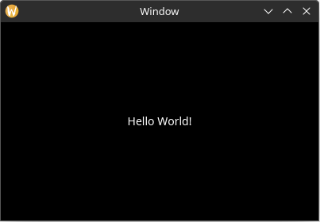

# Dynamic Layout

Setting the bounding rectangle via the element builder works fine for static content, but what if we wanted the layout to dynamically change due to a change in the application state (or the window being resized)? And for that matter, what if we wanted to layout other elements based on the size of the text in the label element?

To achieve this, we will define a "layout function" for our main window. Remove the `.rect` property from the Label builder and then add the following method to `MainWindowElements`:

```rust,no_run
# use yarrow::prelude::*;
# 
# #[derive(Clone)]
# pub enum MyAction {}
# 
# #[derive(Default)]
# struct MyApp {
#     main_window_elements: Option<MainWindowElements>,
# }
# 
# impl Application for MyApp {
#     type Action = MyAction;
# 
#     fn on_window_event(
#         &mut self,
#         event: AppWindowEvent,
#         window_id: WindowID,
#         cx: &mut AppContext<MyAction>,
#     ) {
#         match event {
#             AppWindowEvent::WindowOpened => {
#                 if window_id == MAIN_WINDOW {
#                     let mut cx = cx.window_context(MAIN_WINDOW).unwrap();
# 
#                     self.main_window_elements =
#                         Some(MainWindowElements::build(&mut cx));
#                 }
#             }
#             _ => {}
#         }
#     }
# }
# 
# pub struct MainWindowElements {
#     hello_label: Label,
# }
# 
impl MainWindowElements {
#     pub fn build(cx: &mut WindowContext<'_, MyAction>) -> Self {
#         Self {
#             hello_label: Label::builder()
#                 .text("Hello World!")
#                 .build(cx),
#         }
#     }
# 
    // ...

    // new
    pub fn layout(&mut self, cx: &mut WindowContext<'_, MyAction>) {
        let label_size = self.hello_label.desired_size(cx.res); // 1

        // Center the label inside the window
        let window_rect = Rect::from_size(cx.logical_size()); // 2
        let label_rect = centered_rect(window_rect.center(), label_size); // 3

        self.hello_label.el.set_rect(label_rect); // 4
    }
}
# 
# pub fn main() {
#     let (action_sender, action_receiver) = yarrow::action_channel();
# 
#     yarrow::run_blocking(MyApp::default(), action_sender, action_receiver).unwrap();
# }
```

1. The `desired_size` method can be used to get the desired size of any element with text content (or some other dynamically sized content). This value is automatically cached by the element, so it is relatively inexpensive to call it over and over again if need be.
2. Get the size of the window from the window context. Also convert that size into a rectangle for ease of use later (Yarrow uses [euclid](https://crates.io/crates/euclid) for geometric types).
3. Create a rectangle that is centered inside of `window_rect` using the provided helper method.
4. Set the bounding rectangle via the label element's handle. Note the `.el` in the middle. Every element handle has a generic `el` field with generic methods that are shared by all element types. For example, the generic `el` field also has a `rect()` method that can retrieve the current bounding rectangle of the element, which is very useful when the layout of some elements depend on the layout of other elements.

Also note that setting the bounding rectangle via the element's handle will not trigger an update in Yarrow's system unless that rectangle has changed. Therefore you can still get good performance even when you have a single layout function like this. However, if the performance still isn't good enough, you can change it to be as optimized and fine-grained as you wish. You are in control!

> Note that the same effect can be achieved by using the `layout_aligned` method on the `Label` handle:
> ```rust,ignore
> let window_rect = Rect::from_size(cx.logical_size());
> self.hello_label.layout_aligned(window_rect.center(), Align2::CENTER, cx.res);
> ```

Now we must call that layout function after the main window is built and whenever the window resizes. To do this, add the following to the `on_window_event` trait method:

```rust,no_run
# use yarrow::prelude::*;
# 
# #[derive(Clone)]
# pub enum MyAction {}
# 
# #[derive(Default)]
# struct MyApp {
#     main_window_elements: Option<MainWindowElements>,
# }
# 
# impl Application for MyApp {
#     type Action = MyAction;
# 
#     fn on_window_event(
#         &mut self,
#         event: AppWindowEvent,
#         window_id: WindowID,
#         cx: &mut AppContext<MyAction>,
#     ) {
        match event {
#             AppWindowEvent::WindowOpened => {
#                 if window_id == MAIN_WINDOW {
#                     let mut cx = cx.window_context(MAIN_WINDOW).unwrap();
# 
#                     self.main_window_elements =
#                         Some(MainWindowElements::build(&mut cx));
#                 }
#             }
            // ...

            // new
            AppWindowEvent::WindowResized => {
                if window_id == MAIN_WINDOW {
                    let mut cx =
                        cx.window_context(MAIN_WINDOW).unwrap();

                    self.main_window_elements
                        .as_mut()
                        .unwrap()
                        .layout(&mut cx);
                }
            }
            _ => {}
        }
#     }
# }
# 
# pub struct MainWindowElements {
#     hello_label: Label,
# }
# 
# impl MainWindowElements {
#     pub fn build(cx: &mut WindowContext<'_, MyAction>) -> Self {
#         Self {
#             hello_label: Label::builder()
#                 .text("Hello World!")
#                 .build(cx),
#         }
#     }
# 
#     pub fn layout(&mut self, cx: &mut WindowContext<'_, MyAction>) {
#         let label_size = self.hello_label.desired_size(cx.res); // 1
# 
#         // Center the label inside the window
#         let window_rect = Rect::from_size(cx.logical_size()); // 2
#         let label_rect = centered_rect(window_rect.center(), label_size); // 3
# 
#         self.hello_label.el.set_rect(label_rect); // 4
#     }
# }
# 
# pub fn main() {
#     let (action_sender, action_receiver) = yarrow::action_channel();
# 
#     yarrow::run_blocking(MyApp::default(), action_sender, action_receiver).unwrap();
# }
```

Now the label stays in the center of the window!

