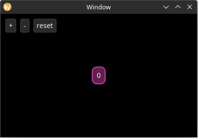

# Responding to Actions

Now it's time to make our application do things. Let's start by making a simple counter that gets incremented when the user selects the "increase" button, gets decremented when the user selects the "decrease" button, and resets when the user selects the "reset" button.

In Yarrow, any single event that a user can perform in your application is called an "Action". *(While I could have called it an "Event", I chose this name to differentiate it from events that elements receive from Yarrow.)*

## Defining the Actions

We get to define whatever actions we want. Rust's `enum` type works especially well here 🦀:

```rust,no_run
# use yarrow::prelude::*;
# 
#[derive(Clone)]
// changed
pub enum MyAction {
    OffsetCounterBy(i32), // 1
    ResetCounter,
}
# 
# #[derive(Default)]
# struct MyApp {
#     main_window_elements: Option<MainWindowElements>,
#     style: MyStyle,
# }
# 
# impl Application for MyApp {
#     type Action = MyAction;
# 
#     fn on_window_event(
#         &mut self,
#         event: AppWindowEvent,
#         window_id: WindowID,
#         cx: &mut AppContext<MyAction>,
#     ) {
#         match event {
#             AppWindowEvent::WindowOpened => {
#                 if window_id == MAIN_WINDOW {
#                     self.style.load(&mut cx.res);
# 
#                     let mut cx = cx.window_context(MAIN_WINDOW).unwrap();
# 
#                     self.main_window_elements = Some(MainWindowElements::build(&mut cx));
#                 }
#             }
#             AppWindowEvent::WindowResized => {
#                 if window_id == MAIN_WINDOW {
#                     let mut cx = cx.window_context(MAIN_WINDOW).unwrap();
# 
#                     self.main_window_elements
#                         .as_mut()
#                         .unwrap()
#                         .layout(&mut cx);
#                 }
#             }
#             _ => {}
#         }
#     }
# }
# 
# pub struct MainWindowElements {
#     hello_label: Label,
# }
# 
# impl MainWindowElements {
#     pub fn build(cx: &mut WindowContext<'_, MyAction>) -> Self {
#         Self {
#             hello_label: Label::builder()
#                 .class(MyStyle::CLASS_FANCY_LABEL)
#                 .text("Hello World!")
#                 .build(cx),
#         }
#     }
# 
#     pub fn layout(&mut self, cx: &mut WindowContext<'_, MyAction>) {
#         let label_size = self.hello_label.desired_size(cx.res);
# 
#         // Center the label inside the window
#         let window_rect = Rect::from_size(cx.logical_size());
#         let label_rect = centered_rect(window_rect.center(), label_size);
# 
#         self.hello_label.el.set_rect(label_rect);
#     }
# }
# 
# #[derive(Default)]
# struct MyStyle {}
# 
# impl MyStyle {
#     pub const CLASS_FANCY_LABEL: ClassID = 1;
# 
#     pub fn load(&self, res: &mut ResourceCtx) {
#         yarrow::theme::yarrow_dark::load(Default::default(), res);
# 
#         res.style_system.add(
#             Self::CLASS_FANCY_LABEL,
#             true,
#             LabelStyle {
#                 back_quad: QuadStyle {
#                     bg: background_hex(0x641e50),
#                     border: border(hex(0xc83ca0), 2.0, radius(10.0)),
#                     ..Default::default()
#                 },
#                 text_padding: padding_all_same(10.0),
#                 ..Default::default()
#             },
#         );
#     }
# }
# 
# pub fn main() {
#     let (action_sender, action_receiver) = yarrow::action_channel();
# 
#     yarrow::run_blocking(MyApp::default(), action_sender, action_receiver).unwrap();
# }
```

1. While we could have just defined two enum variants called `IncrementValue` and `DecrementValue`, I want to show an example of an action that has associated data.

## Storing and Syncing State

We also need to store the state of our counter somewhere. Also, let's add a method to `MyApp` that syncs the label text to the state:

```rust,no_run
# use yarrow::prelude::*;
# 
# #[derive(Clone)]
# pub enum MyAction {
#     OffsetCounterBy(i32),
#     ResetCounter,
# }
# 
#[derive(Default)]
struct MyApp {
    main_window_elements: Option<MainWindowElements>,
    style: MyStyle,

    count: i32, // new
}

// new
impl MyApp {
    pub fn sync_state(&mut self, cx: &mut WindowContext<'_, MyAction>) {
        let Some(elements) = &mut self.main_window_elements else { // 1
            return;
        };

        // 2
        if elements
            .hello_label
            .set_text(Some(&format!("{}", self.count)), cx.res)
        {
            // Changing the text may resize the label, so do a layout.
            elements.layout(cx);
        }
    }
}

// ...

# impl Application for MyApp {
#     type Action = MyAction;
# 
#     fn on_window_event(
#         &mut self,
#         event: AppWindowEvent,
#         window_id: WindowID,
#         cx: &mut AppContext<MyAction>,
#     ) {
#         match event {
            AppWindowEvent::WindowOpened => {
                if window_id == MAIN_WINDOW {
                    self.style.load(&mut cx.res);

                    let mut cx = cx.window_context(MAIN_WINDOW).unwrap();

                    self.main_window_elements =
                        Some(MainWindowElements::build(&mut cx));

                    // new
                    self.sync_state(&mut cx);
                }
#             }
#             AppWindowEvent::WindowResized => {
#                 if window_id == MAIN_WINDOW {
#                     let mut cx = cx.window_context(MAIN_WINDOW).unwrap();
# 
#                     self.main_window_elements
#                         .as_mut()
#                         .unwrap()
#                         .layout(&mut cx);
#                 }
#             }
#             _ => {}
#         }
#     }
# }
# 
# pub struct MainWindowElements {
#     hello_label: Label,
# }
# 
# impl MainWindowElements {
#     pub fn build(cx: &mut WindowContext<'_, MyAction>) -> Self {
#         Self {
#             hello_label: Label::builder()
#                 .class(MyStyle::CLASS_FANCY_LABEL)
#                 .text("Hello World!")
#                 .build(cx),
#         }
#     }
# 
#     pub fn layout(&mut self, cx: &mut WindowContext<'_, MyAction>) {
#         let label_size = self.hello_label.desired_size(cx.res);
# 
#         // Center the label inside the window
#         let window_rect = Rect::from_size(cx.logical_size());
#         let label_rect = centered_rect(window_rect.center(), label_size);
# 
#         self.hello_label.el.set_rect(label_rect);
#     }
# }
# 
# #[derive(Default)]
# struct MyStyle {}
# 
# impl MyStyle {
#     pub const CLASS_FANCY_LABEL: ClassID = 1;
# 
#     pub fn load(&self, res: &mut ResourceCtx) {
#         yarrow::theme::yarrow_dark::load(Default::default(), res);
# 
#         res.style_system.add(
#             Self::CLASS_FANCY_LABEL,
#             true,
#             LabelStyle {
#                 back_quad: QuadStyle {
#                     bg: background_hex(0x641e50),
#                     border: border(hex(0xc83ca0), 2.0, radius(10.0)),
#                     ..Default::default()
#                 },
#                 text_padding: padding_all_same(10.0),
#                 ..Default::default()
#             },
#         );
#     }
# }
# 
# pub fn main() {
#     let (action_sender, action_receiver) = yarrow::action_channel();
# 
#     yarrow::run_blocking(MyApp::default(), action_sender, action_receiver).unwrap();
# }
```

1. The [`let-else pattern`](https://doc.rust-lang.org/beta/rust-by-example/flow_control/let_else.html) in Rust is useful to extract the elements without placing ugly `unwrap`'s everywhere.
2. Most setters on element handles return a bool on whether or not the value has changed. Note that calling most setters will *NOT* trigger an element update in Yarrow's system unless that value has changed (refer to each setter's documentation). Therefore you can still get good performance even when you have a single `sync_state` function like this. However, if the performance still isn't good enough, you can change it to be as optimized and fine-grained as you wish. You are in control!

## Add Buttons

Now we will create the three new buttons:

```rust,no_run
# use yarrow::prelude::*;
# 
# #[derive(Clone)]
# pub enum MyAction {
#     OffsetCounterBy(i32),
#     ResetCounter,
# }
# 
# #[derive(Default)]
# struct MyApp {
#     main_window_elements: Option<MainWindowElements>,
#     style: MyStyle,
# 
#     count: i32,
# }
# 
# impl MyApp {
#     pub fn sync_state(&mut self, cx: &mut WindowContext<'_, MyAction>) {
#         let Some(elements) = &mut self.main_window_elements else {
#             return;
#         };
# 
#         if elements
#             .hello_label
#             .set_text(Some(&format!("{}", self.count)), cx.res)
#         {
#             // Changing the text may resize the label, so do a layout.
#             elements.layout(cx);
#         }
#     }
# }
# 
# impl Application for MyApp {
#     type Action = MyAction;
# 
#     fn on_window_event(
#         &mut self,
#         event: AppWindowEvent,
#         window_id: WindowID,
#         cx: &mut AppContext<MyAction>,
#     ) {
#         match event {
#             AppWindowEvent::WindowOpened => {
#                 if window_id == MAIN_WINDOW {
#                     self.style.load(&mut cx.res);
# 
#                     let mut cx = cx.window_context(MAIN_WINDOW).unwrap();
# 
#                     self.main_window_elements =
#                         Some(MainWindowElements::build(&mut cx));
# 
#                     self.sync_state(&mut cx);
#                 }
#             }
#             AppWindowEvent::WindowResized => {
#                 if window_id == MAIN_WINDOW {
#                     let mut cx = cx.window_context(MAIN_WINDOW).unwrap();
# 
#                     self.main_window_elements
#                         .as_mut()
#                         .unwrap()
#                         .layout(&mut cx);
#                 }
#             }
#             _ => {}
#         }
#     }
# }
# 
pub struct MainWindowElements {
    hello_label: Label,
    // new
    increment_btn: Button,
    decrement_btn: Button,
    reset_btn: Button,
}

impl MainWindowElements {
    pub fn build(cx: &mut WindowContext<'_, MyAction>) -> Self {
        Self {
            hello_label: Label::builder()
                .class(MyStyle::CLASS_FANCY_LABEL)
                .text("Hello World!")
                .build(cx),
            // new
            increment_btn: Button::builder()
                .text("+")
                .build(cx),
            decrement_btn: Button::builder()
                .text("-")
                .build(cx),
            reset_btn: Button::builder()
                .text("reset")
                .build(cx),
        }
    }

    // ...

#     pub fn layout(&mut self, cx: &mut WindowContext<'_, MyAction>) {
#         let label_size = self.hello_label.desired_size(cx.res);
# 
#         // Center the label inside the window
#         let window_rect = Rect::from_size(cx.logical_size());
#         let label_rect = centered_rect(window_rect.center(), label_size);
# 
#         self.hello_label.el.set_rect(label_rect);
#     }
}
# 
# #[derive(Default)]
# struct MyStyle {}
# 
# impl MyStyle {
#     pub const CLASS_FANCY_LABEL: ClassID = 1;
# 
#     pub fn load(&self, res: &mut ResourceCtx) {
#         yarrow::theme::yarrow_dark::load(Default::default(), res);
# 
#         res.style_system.add(
#             Self::CLASS_FANCY_LABEL,
#             true,
#             LabelStyle {
#                 back_quad: QuadStyle {
#                     bg: background_hex(0x641e50),
#                     border: border(hex(0xc83ca0), 2.0, radius(10.0)),
#                     ..Default::default()
#                 },
#                 text_padding: padding_all_same(10.0),
#                 ..Default::default()
#             },
#         );
#     }
# }
# 
# pub fn main() {
#     let (action_sender, action_receiver) = yarrow::action_channel();
# 
#     yarrow::run_blocking(MyApp::default(), action_sender, action_receiver).unwrap();
# }
```

Now to lay out the buttons so they are visible. While we're at it, let's add additional styling information in our `MyStyle` struct so we can easily tweak all style parameters from a single location:

```rust,no_run
# use yarrow::prelude::*;
# 
# #[derive(Clone)]
# pub enum MyAction {
#     OffsetCounterBy(i32),
#     ResetCounter,
# }
# 
# #[derive(Default)]
# struct MyApp {
#     main_window_elements: Option<MainWindowElements>,
#     style: MyStyle,
# 
#     count: i32,
# }
# 
# impl MyApp {
#     pub fn sync_state(&mut self, cx: &mut WindowContext<'_, MyAction>) {
#         let Some(elements) = &mut self.main_window_elements else {
#             return;
#         };
# 
#         if elements
#             .hello_label
#             .set_text(Some(&format!("{}", self.count)), cx.res)
#         {
#             // Changing the text may resize the label, so do a layout.
            elements.layout(&self.style, cx); // changed
#         }
#     }
# }

// ...

# impl Application for MyApp {
#     type Action = MyAction;
# 
#     fn on_window_event(
#         &mut self,
#         event: AppWindowEvent,
#         window_id: WindowID,
#         cx: &mut AppContext<MyAction>,
#     ) {
#         match event {
#             AppWindowEvent::WindowOpened => {
#                 if window_id == MAIN_WINDOW {
#                     self.style.load(&mut cx.res);
# 
#                     let mut cx = cx.window_context(MAIN_WINDOW).unwrap();
# 
#                     self.main_window_elements =
#                         Some(MainWindowElements::build(&mut cx));
# 
#                     self.sync_state(&mut cx);
#                 }
#             }
#             AppWindowEvent::WindowResized => {
#                 if window_id == MAIN_WINDOW {
#                     let mut cx = cx.window_context(MAIN_WINDOW).unwrap();
# 
                    self.main_window_elements
                        .as_mut()
                        .unwrap()
                        .layout(&self.style, &mut cx); // changed
#                 }
#             }
#             _ => {}
#         }
#     }
# }
# 
# pub struct MainWindowElements {
#     hello_label: Label,
#     increment_btn: Button,
#     decrement_btn: Button,
#     reset_btn: Button,
# }

// ...

# impl MainWindowElements {
#     pub fn build(cx: &mut WindowContext<'_, MyAction>) -> Self {
#         Self {
#             hello_label: Label::builder()
#                 .class(MyStyle::CLASS_FANCY_LABEL)
#                 .text("Hello World!")
#                 .build(cx),
#             increment_btn: Button::builder().text("+").build(cx),
#             decrement_btn: Button::builder().text("-").build(cx),
#             reset_btn: Button::builder().text("reset").build(cx),
#         }
#     }
# 
    // changed (a reference to an instance of style is now passed in)
    pub fn layout(&mut self, style: &MyStyle, cx: &mut WindowContext<'_, MyAction>) {
#         let label_size = self.hello_label.desired_size(cx.res);
# 
#         // Center the label inside the window
#         let window_rect = Rect::from_size(cx.logical_size());
#         let label_rect = centered_rect(window_rect.center(), label_size);
# 
#         self.hello_label.el.set_rect(label_rect);
        // ...

        // new
        self.increment_btn.layout(
            point(style.window_padding.left, style.window_padding.top),
            cx.res,
        );
        self.decrement_btn.layout(
            point(
                self.increment_btn.el.rect().max_x() + style.button_spacing,
                style.window_padding.top,
            ),
            cx.res,
        );
        self.reset_btn.layout(
            point(
                self.decrement_btn.el.rect().max_x() + style.button_spacing,
                style.window_padding.top,
            ),
            cx.res,
        );
    }
# }

// ...

// changed
pub struct MyStyle {
    window_padding: Padding, // *
    button_spacing: f32,
}

// new
impl Default for MyStyle {
    fn default() -> Self {
        Self {
            window_padding: padding_all_same(10.0),
            button_spacing: 8.0,
        }
    }
}
# 
# impl MyStyle {
#     pub const CLASS_FANCY_LABEL: ClassID = 1;
# 
#     pub fn load(&self, res: &mut ResourceCtx) {
#         yarrow::theme::yarrow_dark::load(Default::default(), res);
# 
#         res.style_system.add(
#             Self::CLASS_FANCY_LABEL,
#             true,
#             LabelStyle {
#                 back_quad: QuadStyle {
#                     bg: background_hex(0x641e50),
#                     border: border(hex(0xc83ca0), 2.0, radius(10.0)),
#                     ..Default::default()
#                 },
#                 text_padding: padding_all_same(10.0),
#                 ..Default::default()
#             },
#         );
#     }
# }
# 
# pub fn main() {
#     let (action_sender, action_receiver) = yarrow::action_channel();
# 
#     yarrow::run_blocking(MyApp::default(), action_sender, action_receiver).unwrap();
# }
```

> \* Note, you can choose to use constants for this styling information instead so you don't have to pass around an instance of `MyStyle`:
> ```rust,ignore
> impl MyStyle {
>   pub const WINDOW_PADDING: Padding = padding_all_same(10.0);
>   pub const BUTTON_SPACING: f32 = 8.0;
> 
>   // ...
> }
> ```
> However, this won't allow you to be able to change the styling information at runtime (i.e. such as loading from a custom style sheet).

The app should now display the following:



## Handle the Actions

Finally, let's add the appropriate actions to the buttons and handle them:

```rust,no_run
# use yarrow::prelude::*;
# 
# #[derive(Clone)]
# pub enum MyAction {
#     OffsetCounterBy(i32),
#     ResetCounter,
# }
# 
# #[derive(Default)]
# struct MyApp {
#     main_window_elements: Option<MainWindowElements>,
#     style: MyStyle,
# 
#     count: i32,
# }
# 
# impl MyApp {
#     pub fn sync_state(&mut self, cx: &mut WindowContext<'_, MyAction>) {
#         let Some(elements) = &mut self.main_window_elements else {
#             return;
#         };
# 
#         if elements
#             .hello_label
#             .set_text(Some(&format!("{}", self.count)), cx.res)
#         {
#             // Changing the text may resize the label, so do a layout.
#             elements.layout(&self.style, cx); // changed
#         }
#     }
# }
# 
impl Application for MyApp {
    type Action = MyAction;

    // new
    fn on_action_emitted(&mut self, cx: &mut AppContext<Self::Action>) {
        let Some(mut cx) = cx.window_context(MAIN_WINDOW) else { // 1
            return;
        };

        while let Ok(action) = cx.action_receiver.try_recv() {
            match action {
                MyAction::OffsetCounterBy(offset) => {
                    self.count += offset;
                    self.sync_state(&mut cx);
                }
                MyAction::ResetCounter => {
                    self.count = 0;
                    self.sync_state(&mut cx);
                }
            }
        }
    }

    // ...
#     fn on_window_event(
#         &mut self,
#         event: AppWindowEvent,
#         window_id: WindowID,
#         cx: &mut AppContext<MyAction>,
#     ) {
#         match event {
#             AppWindowEvent::WindowOpened => {
#                 if window_id == MAIN_WINDOW {
#                     self.style.load(&mut cx.res);
# 
#                     let mut cx = cx.window_context(MAIN_WINDOW).unwrap();
# 
#                     self.main_window_elements =
#                         Some(MainWindowElements::build(&mut cx));
# 
#                     self.sync_state(&mut cx);
#                 }
#             }
#             AppWindowEvent::WindowResized => {
#                 if window_id == MAIN_WINDOW {
#                     let mut cx = cx.window_context(MAIN_WINDOW).unwrap();
# 
#                     self.main_window_elements
#                         .as_mut()
#                         .unwrap()
#                         .layout(&self.style, &mut cx); // changed
#                 }
#             }
#             _ => {}
#         }
#     }
}

// ...

# pub struct MainWindowElements {
#     hello_label: Label,
#     increment_btn: Button,
#     decrement_btn: Button,
#     reset_btn: Button,
# }
# 
# impl MainWindowElements {
#     pub fn build(cx: &mut WindowContext<'_, MyAction>) -> Self {
#         Self {
#             hello_label: Label::builder()
#                 .class(MyStyle::CLASS_FANCY_LABEL)
#                 .text("Hello World!")
#                 .build(cx),
            increment_btn: Button::builder()
                .text("+")
                .on_select(MyAction::OffsetCounterBy(1)) // new
                .build(cx),
            decrement_btn: Button::builder()
                .text("-")
                .on_select(MyAction::OffsetCounterBy(-1)) // new
                .build(cx),
            reset_btn: Button::builder()
                .text("reset")
                .on_select(MyAction::ResetCounter) // new
                .build(cx),
#         }
#     }
# 
#     pub fn layout(&mut self, style: &MyStyle, cx: &mut WindowContext<'_, MyAction>) {
#         let label_size = self.hello_label.desired_size(cx.res);
# 
#         // Center the label inside the window
#         let window_rect = Rect::from_size(cx.logical_size());
#         let label_rect = centered_rect(window_rect.center(), label_size);
# 
#         self.hello_label.el.set_rect(label_rect);
# 
#         self.increment_btn.layout(
#             point(style.window_padding.left, style.window_padding.top),
#             cx.res,
#         );
#         self.decrement_btn.layout(
#             point(
#                 self.increment_btn.el.rect().max_x() + style.button_spacing,
#                 style.window_padding.top,
#             ),
#             cx.res,
#         );
#         self.reset_btn.layout(
#             point(
#                 self.decrement_btn.el.rect().max_x() + style.button_spacing,
#                 style.window_padding.top,
#             ),
#             cx.res,
#         );
#     }
# }
# 
# pub struct MyStyle {
#     window_padding: Padding,
#     button_spacing: f32,
# }
# 
# impl Default for MyStyle {
#     fn default() -> Self {
#         Self {
#             window_padding: padding_all_same(10.0),
#             button_spacing: 8.0,
#         }
#     }
# }
# 
# impl MyStyle {
#     pub const CLASS_FANCY_LABEL: ClassID = 1;
# 
#     pub fn load(&self, res: &mut ResourceCtx) {
#         yarrow::theme::yarrow_dark::load(Default::default(), res);
# 
#         res.style_system.add(
#             Self::CLASS_FANCY_LABEL,
#             true,
#             LabelStyle {
#                 back_quad: QuadStyle {
#                     bg: background_hex(0x641e50),
#                     border: border(hex(0xc83ca0), 2.0, radius(10.0)),
#                     ..Default::default()
#                 },
#                 text_padding: padding_all_same(10.0),
#                 ..Default::default()
#             },
#         );
#     }
# }
# 
# pub fn main() {
#     let (action_sender, action_receiver) = yarrow::action_channel();
# 
#     yarrow::run_blocking(MyApp::default(), action_sender, action_receiver).unwrap();
# }
```

1. The [`let-else pattern`](https://doc.rust-lang.org/beta/rust-by-example/flow_control/let_else.html) can be useful here again so the window context doesn't have to be extracted from the application context inside every match variant. Although note this won't work if you have multiple windows in your application.

Now run the application and count things!

## Improving `sync_state`

One last thing, while our `sync_count` function is fine for this simple application, in a larger application you will probably want to only perform a single state sync and layout once for every invocation of `on_action_emitted`.

One strategy is to pass around a bool like this:

```rust,no_run
# use yarrow::prelude::*;
# 
# #[derive(Clone)]
# pub enum MyAction {
#     OffsetCounterBy(i32),
#     ResetCounter,
# }
# 
# #[derive(Default)]
# struct MyApp {
#     main_window_elements: Option<MainWindowElements>,
#     style: MyStyle,
# 
#     count: i32,
# }
# 
# impl MyApp {
    // changed
    pub fn sync_state(&mut self, cx: &mut WindowContext<'_, MyAction>) {
        let Some(elements) = &mut self.main_window_elements else {
            return;
        };

        let mut needs_layout = false;

        if elements
            .hello_label
            .set_text(Some(&format!("{}", self.count)), cx.res)
        {
            // Changing the text may resize the label, so do a layout.
            needs_layout = true;
        }

        if needs_layout {
            elements.layout(&self.style, cx);
        }
    }
# }

// ...

# impl Application for MyApp {
#     type Action = MyAction;
# 
    // changed
    fn on_action_emitted(&mut self, cx: &mut AppContext<Self::Action>) {
        let Some(mut cx) = cx.window_context(MAIN_WINDOW) else {
            return;
        };

        let mut state_changed = false;

        while let Ok(action) = cx.action_receiver.try_recv() {
            match action {
                MyAction::OffsetCounterBy(offset) => {
                    self.count += offset;
                    state_changed = true;
                }
                MyAction::ResetCounter => {
                    self.count = 0;
                    state_changed = true;
                }
            }
        }

        if state_changed {
            self.sync_state(&mut cx);
        }
    }
# 
#     fn on_window_event(
#         &mut self,
#         event: AppWindowEvent,
#         window_id: WindowID,
#         cx: &mut AppContext<MyAction>,
#     ) {
#         match event {
#             AppWindowEvent::WindowOpened => {
#                 if window_id == MAIN_WINDOW {
#                     self.style.load(&mut cx.res);
# 
#                     let mut cx = cx.window_context(MAIN_WINDOW).unwrap();
# 
#                     self.main_window_elements =
#                         Some(MainWindowElements::build(&mut cx));
# 
#                     self.sync_state(&mut cx);
#                 }
#             }
#             AppWindowEvent::WindowResized => {
#                 if window_id == MAIN_WINDOW {
#                     let mut cx = cx.window_context(MAIN_WINDOW).unwrap();
# 
#                     self.main_window_elements
#                         .as_mut()
#                         .unwrap()
#                         .layout(&self.style, &mut cx);
#                 }
#             }
#             _ => {}
#         }
#     }
# }
# 
# pub struct MainWindowElements {
#     hello_label: Label,
#     increment_btn: Button,
#     decrement_btn: Button,
#     reset_btn: Button,
# }
# 
# impl MainWindowElements {
#     pub fn build(cx: &mut WindowContext<'_, MyAction>) -> Self {
#         Self {
#             hello_label: Label::builder()
#                 .class(MyStyle::CLASS_FANCY_LABEL)
#                 .text("Hello World!")
#                 .build(cx),
#             increment_btn: Button::builder()
#                 .text("+")
#                 .on_select(MyAction::OffsetCounterBy(1))
#                 .build(cx),
#             decrement_btn: Button::builder()
#                 .text("-")
#                 .on_select(MyAction::OffsetCounterBy(-1))
#                 .build(cx),
#             reset_btn: Button::builder()
#                 .text("reset")
#                 .on_select(MyAction::ResetCounter)
#                 .build(cx),
#         }
#     }
# 
#     pub fn layout(&mut self, style: &MyStyle, cx: &mut WindowContext<'_, MyAction>) {
#         let label_size = self.hello_label.desired_size(cx.res);
# 
#         // Center the label inside the window
#         let window_rect = Rect::from_size(cx.logical_size());
#         let label_rect = centered_rect(window_rect.center(), label_size);
# 
#         self.hello_label.el.set_rect(label_rect);
# 
#         self.increment_btn.layout(
#             point(style.window_padding.left, style.window_padding.top),
#             cx.res,
#         );
#         self.decrement_btn.layout(
#             point(
#                 self.increment_btn.el.rect().max_x() + style.button_spacing,
#                 style.window_padding.top,
#             ),
#             cx.res,
#         );
#         self.reset_btn.layout(
#             point(
#                 self.decrement_btn.el.rect().max_x() + style.button_spacing,
#                 style.window_padding.top,
#             ),
#             cx.res,
#         );
#     }
# }
# 
# pub struct MyStyle {
#     window_padding: Padding,
#     button_spacing: f32,
# }
# 
# impl Default for MyStyle {
#     fn default() -> Self {
#         Self {
#             window_padding: padding_all_same(10.0),
#             button_spacing: 8.0,
#         }
#     }
# }
# 
# impl MyStyle {
#     pub const CLASS_FANCY_LABEL: ClassID = 1;
# 
#     pub fn load(&self, res: &mut ResourceCtx) {
#         yarrow::theme::yarrow_dark::load(Default::default(), res);
# 
#         res.style_system.add(
#             Self::CLASS_FANCY_LABEL,
#             true,
#             LabelStyle {
#                 back_quad: QuadStyle {
#                     bg: background_hex(0x641e50),
#                     border: border(hex(0xc83ca0), 2.0, radius(10.0)),
#                     ..Default::default()
#                 },
#                 text_padding: padding_all_same(10.0),
#                 ..Default::default()
#             },
#         );
#     }
# }
# 
# pub fn main() {
#     let (action_sender, action_receiver) = yarrow::action_channel();
# 
#     yarrow::run_blocking(MyApp::default(), action_sender, action_receiver).unwrap();
# }
```

And again, it's up to you how fine-grained and optimized you want your state synchronization and layout to be. You are in control!

The full source code of the completed tutorial can be found [here](https://github.com/MeadowlarkDAW/Yarrow/blob/main/examples/counter_tutorial.rs).