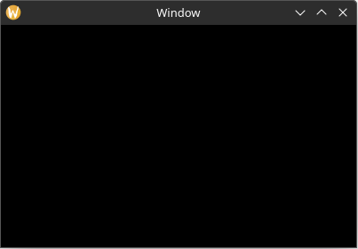

# Setting Up

First, create a new Rust project with the following command:

`cargo new --bin hello_yarrow`

## Adding Yarrow as a dependency

In the newly created directory, open the `Cargo.toml` file and add the following under `[dependencies]`:

```toml
[package]
name = "hello_yarrow"
version = "0.1.0"
edition = "2021"

[dependencies]
yarrow = { git = "https://github.com/MeadowlarkDAW/Yarrow.git", rev = "5b14326ea41e762a7b941147d0c7d32279abc63b" }
```

> Yarrow does not have a recent version published on crates.io yet, so you will need to use the git version for now.
>
> You can update the revision number to the [latest commit hash from the GitHub repository](https://github.com/MeadowlarkDAW/Yarrow/commits/main/). You can also choose to instead use `branch = "main"`, but keep in mind this may introduce breaking changes.

## Enabling Additional Optimizations

Some aspects of Yarrow such as text shaping can run very slow when compiled in debug mode without any optimizations. It is recommended to add the follow to your `Cargo.toml` file to get acceptable performance when running in debug mode:

```toml
[profile.dev]
opt-level = 1
```

This tells cargo to enable a small amount of optimizations when compiling in debug mode. You can learn more about cargo profiles [here](https://doc.rust-lang.org/cargo/reference/profiles.html).

## Initializing the Application

In `main.rs`, replace the default contents with the following:

```rust,no_run
use yarrow::prelude::*; // 1

#[derive(Clone)]
pub enum MyAction {} // 2

#[derive(Default)]
struct MyApp {} // 3

impl Application for MyApp { // 4
    type Action = MyAction; // 5
}

pub fn main() {
    let (action_sender, action_receiver) = yarrow::action_channel(); // 6

    // 7
    yarrow::run_blocking(MyApp::default(), action_sender, action_receiver).unwrap();
}
```

Here is a breakdown of what is happening:

1. Import a bunch of types from Yarrow. For simplicity, Yarrow provides a `prelude` module that re-exports most of everything you need.
2. Our application's Action enum type. We will cover what actions are and how they work later in this tutorial. For now we have no actions, so leave it empty. (Note that your action type must implement [`Clone`](https://doc.rust-lang.org/std/clone/trait.Clone.html).)
3. Our application struct. This is where we will store everything related to our application.
4. The `yarrow::Application` trait. We must implement this for our application object.
5. Define the type to use as our applications's action enum.
6. Create an action channel. This is essentially an [mpsc](https://doc.rust-lang.org/std/sync/mpsc/) channel from Rust's standard library.
7. Run the application. For standalone applications you will want to use `run_blocking`, but Yarrow contains other methods for running in different contexts (like an audio plugin).

## Running the Application

Now run the application using the command `cargo run`. Once it finishes compiling you should see an empty black window.



> The first compile may take quite a while as it is compiling an entire GUI library from scratch. Subsequent compiles should be much faster.

Yarrow is still experimental software. If you run into any issues while compiling or running this code, please create an issue in the [github repository](https://github.com/MeadowlarkDAW/Yarrow/issues).